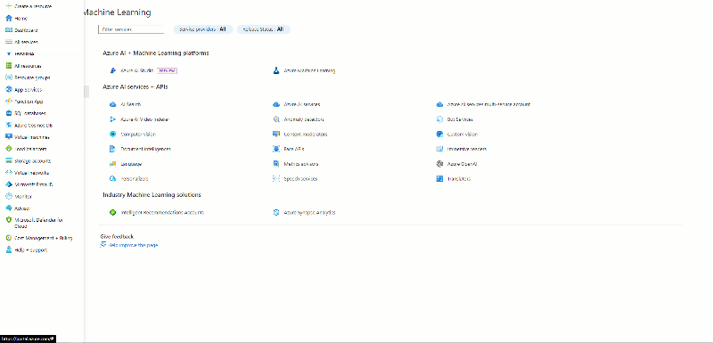

## Seguencia de passos executados para execução do laboratório: 

### No Azure Machine Learning Studio foi criado um novo trabalho de ML automatizado usando as seguintes configurações:
Fonte: https://microsoftlearning.github.io/mslearn-ai-fundamentals/Instructions/Labs/01-machine-learning.html

**Configurações básicas:**
* Nome do trabalho: mslearn-bike-automl
* Nome do experimento: mslearn-bike-rental
* Descrição: Aprendizado de máquina automatizado para previsão de aluguel de bicicletas
* Marcadores: nenhum

**Tipo de tarefa e dados:**

* Selecione o tipo de tarefa : Regressão
* Selecionar conjunto de dados : crie um novo conjunto de dados com as seguintes configurações:

    **Tipo de dados:**
    * Nome : aluguel de bicicletas
    * Descrição : dados históricos de aluguel de bicicletas
    * Tipo : Tabular

    **Fonte de dados:**
    * Selecione: Dos arquivos da web

    **URL da Web:**
    * URL da Web : https://aka.ms/bike-rentals
    * Ignorar validação de dados : não selecionar

    **Configurações:**
    * Formato de arquivo : Delimitado
    * Delimitador : Vírgula
    * Codificação : UTF-8
    * Cabeçalhos de coluna : apenas o primeiro arquivo possui cabeçalhos
    * Pular linhas : Nenhum
    * O conjunto de dados contém dados multilinhas : não selecione

    **Esquema:**
    * Incluir todas as colunas exceto Caminho
    * Revise os tipos detectados automaticamente

    **Selecionado:** Criar

**Configurações de tarefa:**

* Tipo de tarefa : Regressão
* Conjunto de dados : aluguel de bicicletas
* Coluna de destino : Aluguéis (inteiro)
* Configurações adicionais :

    * Métrica primária : raiz do erro quadrático médio normalizado
    * Explique o melhor modelo : Não selecionado
    * Usar todos os modelos suportados : Desmarcado . Você restringirá o trabalho para tentar apenas alguns algoritmos específicos.
    * Modelos permitidos : Selecione apenas RandomForest e LightGBM — normalmente você gostaria de tentar o máximo possível, mas cada modelo adicionado aumenta o tempo necessário para executar o trabalho.

**Limites:** 
* Máximo de testes : 3
* Máximo de testes simultâneos : 3
* Máximo de nós : 3
* Limite de pontuação da métrica : 0,085 ( para que, se um modelo atingir uma pontuação da métrica de erro quadrático médio normalizado de 0,085 ou menos, o trabalho termina. )
* Tempo limite : 15
* Tempo limite de iteração : 15
* Habilitar rescisão antecipada : selecionado

**Validação e teste:**
* Tipo de validação : divisão de validação de trem
* Porcentagem de dados de validação : 10
* Conjunto de dados de teste : Nenhum

**Calcular:**
* Selecione o tipo de computação : sem servidor
* Tipo de máquina virtual : CPU
* Camada de máquina virtual : Dedicada
* Tamanho da máquina virtual : Standard_DS3_V2*
* Número de instâncias : 1

## Implantando e testando o modelo

**Modelo** => **Implantar**
* Nome : prever-aluguéis
* Descrição : Prever aluguel de bicicletas
* Tipo de computação : Instância de Contêiner do Azure
* Habilitar autenticação : selecionado

## Testando o serviço implantado

Endpoints -> Teste 

Código de teste:

 ```bash
 {
   "Inputs": { 
     "data": [
       {
         "day": 1,
         "mnth": 1,   
         "year": 2022,
         "season": 2,
         "holiday": 0,
         "weekday": 1,
         "workingday": 1,
         "weathersit": 2, 
         "temp": 0.3, 
         "atemp": 0.3,
         "hum": 0.3,
         "windspeed": 0.3 
       }
     ]    
   },   
   "GlobalParameters": 1.0
 }
```

### 📌 Visualização



</br>
